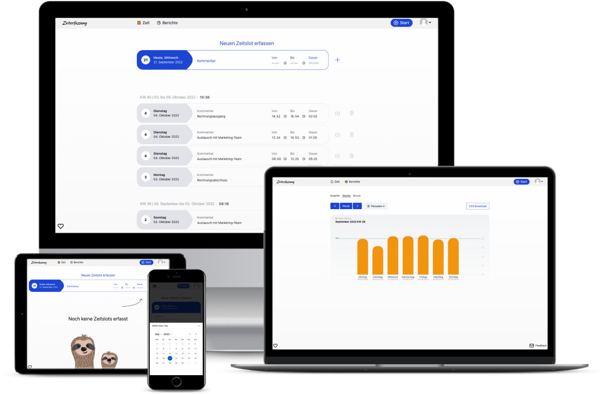

# Zeiterfassung [](https://github.com/urlaubsverwaltung/zeiterfassung/actions/workflows/build.yml)

Ist bei euch die Zeiterfassung auch gerade ein großes Thema? Das trifft sich gut!

Durchstarten mit der Zeiterfassung! Folgende Funktionen sind bereits enthalten:

* Erfassen von Zeiten: Kommt-Geht Erfassung oder einzelne Zeitbuchungen
* Stoppuhr-Modus
* Visualisierung der geleisteten Stunden auf Wochen und Monatsebene
* Berichte für eigene erfasste Stunden (CSV-Download)
* Berichte für Vorgesetzte (CSV-Download)

Unsere Entwicklung lebt von eurem Feedback. Wir freuen uns die Zeiterfassung mit euch zusammen voranzubringen.
* [GitHub Issue](https://github.com/urlaubsverwaltung/zeiterfassung/issues/new/choose)
* [E-Mail](mailto:info@urlaubsverwaltung.cloud?subject=Zeiterfassung%20-%20Nutzer%20Feedback)

Wenn du mehr Informationen und Bilder über dieses Projekt sehen möchtest dann schaue auf unserer [Landingpage](https://urlaubsverwaltung.cloud/zeiterfassung/) vorbei.



⚠️ Die Dokumentationen zu Betrieb und Entwicklung sind aktuell nur in englischer Sprache verfügbar.

## Operation

### Prerequisites

* [JDK 17](https://adoptium.net)
* [Docker 20.10+](https://www.docker.com/)
* [PostgreSQL 9.6+](#database)
* [E-Mail-Server](#e-mail-server)
* [OpenID Connect identity provider](#openid-connect-identity-provider)

### Download

The application is available as [Docker Image](https://github.com/urlaubsverwaltung/zeiterfassung/pkgs/container/zeiterfassung%2Fzeiterfassung).

### Configuration

The application has a [configuration file](https://github.com/urlaubsverwaltung/zeiterfassung/blob/main/src/main/resources/application.properties) in the `src/main/resources` directory. This includes certain basic settings 
and default values. However, these alone are not sufficient to put the application into production. Specific 
configurations such as the database, e-mail server and security provider must be stored in a separate configuration file or
handed via environment variables.

The options available with Spring Boot for using your own configuration file or environment variables can be found in the 
['External Config' Reference](http://docs.spring.io/spring-boot/docs/current/reference/html/boot-features-external-config.html#boot-features-external-config-application-property-files)

#### Database

The application uses a [PostgresSQL](https://www.postgresql.org/) database management system to store the data.
Create a database in your PostgresSQL database management system with e.g. the name `zeiterfassung`.
and a user with access rights for this database and configure it

```properties
spring.datasource.url=jdbc:postgresql://$HOST:$PORT/$DATABASENAME
spring.datasource.username=$USER
spring.datasource.password=$PASSWORD
```

When you start the application for the first time, all database tables are created automatically.

#### E-Mail-Server

To configure the e-mail server, the following configurations must be made.

```properties
zeiterfassung.mail.from=zeiterfassung@example.org
zeiterfassung.mail.fromDisplayName=zeiterfassung
zeiterfassung.mail.replyTo=replyto@example.org
zeiterfassung.mail.replyToDisplayName=replyto

spring.mail.host=$HOST
spring.mail.port=$PORT
spring.mail.username=$USERNAME
spring.mail.password=$PASSWORD
```

All other `spring.mail.*` configurations can be found in the [Spring Documentation E-Mail](https://docs.spring.io/spring-boot/docs/current/reference/htmlsingle/#io.email)
be viewed.

#### OpenID Connect identity provider

As security provider OIDC-based security providers are possible to use (e.g. [Keycloak](https://www.keycloak.org/), Microsoft Azure AD or other 'OpenID Connect providers').
To configure the security provider, the following configurations must be made.

```properties
spring.security.oauth2.client.registration.default.client-id=zeiterfassung
spring.security.oauth2.client.registration.default.client-secret=$OIDC_CLIENT_SECRET
spring.security.oauth2.client.registration.default.client-name=zeiterfassung
spring.security.oauth2.client.registration.default.provider=default
spring.security.oauth2.client.registration.default.scope=openid,profile,email,roles
spring.security.oauth2.client.registration.default.authorization-grant-type=authorization_code
spring.security.oauth2.client.registration.default.redirect-uri=$OIDC_REDIRECT_URI
spring.security.oauth2.client.provider.default.issuer-uri=$OIDC_ISSUER_URI
zeiterfassung.security.oidc.server-url=$OIDC_SERVER_URL
zeiterfassung.security.oidc.login-form-url=$OIDC_LOGIN_FORM_URL
```

##### Permissions

Zeiterfassung is using user permissions from oidc claim `groups` for mapping possible permissions:

* `ZEITERFASSUNG_ACCESS`: General access to the application aund time tracking features
* `ZEITERFASSUNG_PRIVILEGED`: Access to reports of other users

#### Logging

Sollten beim Starten der Anwendung Probleme auftreten, lässt sich in der Konfigurationsdatei eine
ausführliche Debug-Ausgabe konfigurieren, indem das `logging.level.*` pro Paket konfiguriert wird,

```properties
logging.level.de.focusshift.zeiterfassung=TRACE
logging.level.org.springframework.security=TRACE
```

All other `logging.*` configurations can be found in the [Spring Documentation Logging](https://docs.spring.io/spring-boot/docs/current/reference/htmlsingle/#features.logging)
be viewed.


#### Application as an OS-Service

Since the application is based on Spring Boot, it can be installed very conveniently as a service. How exactly this
works, can be found in the corresponding chapters of the Spring Boot documentation:

* [Linux Service](https://docs.spring.io/spring-boot/docs/current/reference/html/deployment.html#deployment-service)
* [Windows Service](https://docs.spring.io/spring-boot/docs/current/reference/html/deployment.html#deployment-windows)

### Run application

To run the docker container e.g. with following command:

```shell
docker run -p 8080:8080 ghcr.io/urlaubsverwaltung/zeiterfassung/zeiterfassung:$VERSION
```

Replace the $VERSION with a specific version from [the docker images](https://github.com/urlaubsverwaltung/zeiterfassung/pkgs/container/zeiterfassung%2Fzeiterfassung).

As part of a docker-compose setup all configurations can be set in service definition.

## Development

### Prerequisites

* [JDK 17](https://adoptium.net)
* [Docker 20.10.+](https://docs.docker.com/get-docker/)
* [Docker Compose](https://docs.docker.com/compose/install/)


### Clone the repository

Without GitHub account

```bash
https://github.com/urlaubsverwaltung/zeiterfassung.git
```

with GitHub account

```bash
git clone git@github.com:urlaubsverwaltung/zeiterfassung.git
```

### Start the Zeiterfassung

Start the needed dependencies like the database and the keycloak server with

```shell
docker-compose up -d
```

The Zeiterfassung is a [Spring Boot](http://projects.spring.io/spring-boot/) application and can be started 
with the `dev-singletenant` profile that will also generate demo data.

```shell
./mvnw clean spring-boot:run
```

and for Windows user with

```bash
./mvnw.cmd clean spring-boot:run
```

### How to use the Zeiterfassung

The application can then be controlled in the browser via [http://localhost:8060/](http://localhost:8060/).

With the `dev-singletenant` profile a Postgres database is used and demo data is created,
i.e. time entries, tenants and users. Therefore, you can now log into the web interface with different
users.

#### Demo data users 

As a user of a tenant can log in via `http://localhost:8060/`:

| username            | password | role             |
|---------------------|----------|------------------|
| boss@example.org    | secret   | view_reports_all |
| office@example.org  | secret   | view_reports_all |
| user@example.org    | secret   |                  |


### git hooks (optional)

There are some app specific git hooks to automate stuff like:

* Install NodeJS dependencies after `git pull` when `package-lock.json` has changed
* Format files on commit

If you want to take advantage of this automation you can run:

```bash
git config core.hooksPath '.githooks' 
```

The git hooks can be found in the [.githooks](./.githooks/) directory.

### Import DB Dump

You can import a db dump created via `pg_dump` into docker-compose-based postgres:

* paste dump here into root directory and name it `dumpfile.sql`
* edit docker-compose.yml 
```yaml
services:
  postgres:
  ...
    volumes:
      - ./dumpfile.sql:/tmp/dumpfile.sql:ro
```
* start with a fresh docker-compose postgres
* open shell to postgres docker container `docker-compose exec postgres bash`
* exec command inside postgres docker container `PGPASSWORD=$POSTGRES_PASSWORD psql -U $POSTGRES_USER -d $POSTGRES_DB -f /tmp/dumpfile.sql`

## Release

### GitHub action

Go to the GitHub action with the name [release trigger][github-action-release-trigger].
* Click on "Run workflow"
* Add the "Milestone ID" (see in the uri of a milestone)
* Add "Release version"
* Add "Next version"
* Run the workflow

## 3rd party resources

* Icons: https://heroicons.dev
* Sloth image: https://pixabay.com/de/illustrations/faultiere-säugetiere-pelzig-5599313/

[github-action-release-trigger]: https://github.com/urlaubsverwaltung/zeiterfassung/actions/workflows/release-trigger.yml "Release Trigger"
